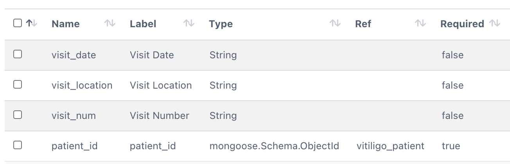
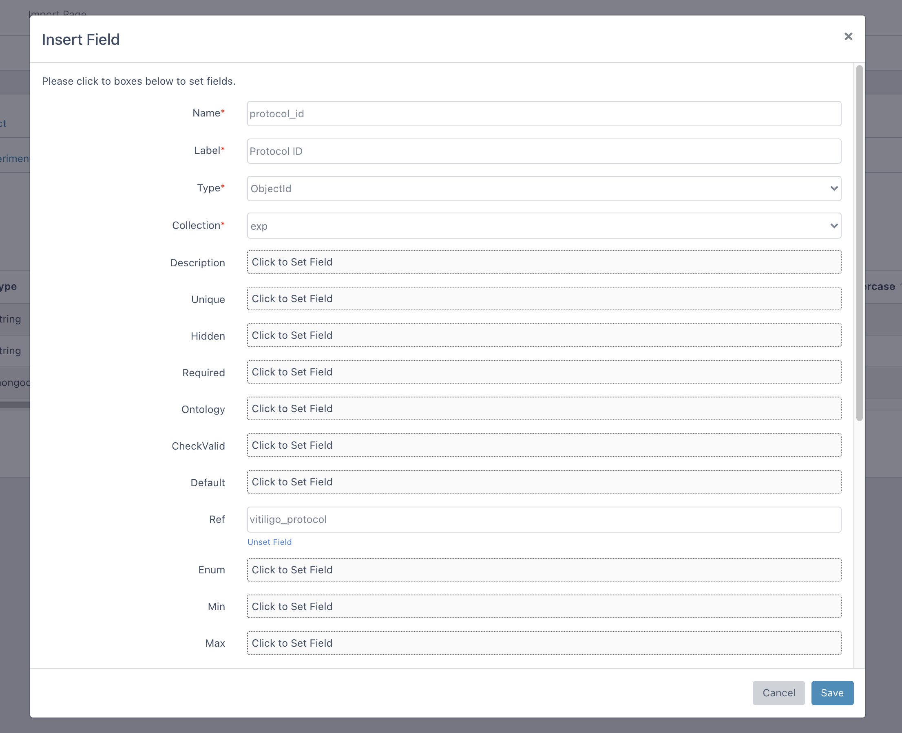

************
Fields Guide
************

This guide will walk you through the details of fields of the collections. 

Dmeta stores the records as field-and-value pairs in the MongoDB database. Therefore after creating collection, we need to specify its fields and by doing that we state the type of data we want to store in each field. Also fields allows you to create parent-child relationships between collections. 

Lets go through basics of the fields. At the top, there are three action buttons to manage fields: **insert**, **edit** and **delete**.

Insert Fields
-------------

In order to insert a new fields, you need to click on the insert button which will open new form as shown below. Here you can enter following fields:

* **Name (required):** Name of the field. 

* **Label (required):** Long version of the field name. 

* **Type (required):** Main configuration parameter for MongoDB fields. Available options are: 
    
    - **String:** To declare a field as a string.
    - **Number:** To declare a field as a number.
    - **Boolean:** To declare a field as a boolean.
    - **Array:** To declare a field as a array. They implicitly have a default value of empty array (``[]``).
    - **Date:** To declare field as a date.
    - **Mixed:** Anything goes into this field.
    - **ObjectId:** An ObjectId is a special type typically used when child reference is defined.

* **Collection:** Choose target collection to insert field. 

* **Description:** Description of the field which will be shown in the form while inserting new data. 

* **Unique:** boolean, whether to define a unique index on this field.

* **Hidden:** Whether to show this field to users.

* **Required:** boolean (e.g. ``true``) or array (e.g. ``[true, "Patient must have a name."]``). When array is used, warning message is defined at the second index of the array to show message when field is not entered. 

* **Ontology:** shows the dropdown options from an ontology API or entered Keyword Array. It is configured with the following parameters:

    - **url:** URL of ontology API to be used for querying available options.
    - **authorization:** Optional authorization header of the API request. Typically, token could be entered for authorization.
    - **filter:** Additional query parameters to filter out retrieved data. (e.g. to only retrieve specific (EFO) ontology data, you can use: `&ontologies=EFO`)
    - **field:** Describe the location of the keyword in the result of the API. Commonly APIs return array of objects. By using dot notation, location of the keyword (e.g. ``collection.prefLabel`` could be described for following example:
    
    .. sourcecode:: json
    
        {
            "status": "success",
            "data": {
                "data": [
                    {
                        "_id": "5fdb8820d6330eb80d503a31",
                        "collection": {
                                        "prefLabel": "Lupus",
                                        "obsolete": false
                                       }
                    },
                    {
                        "_id": "5fdb8820d6330eb80d503a31",
                        "collection": {
                                        "prefLabel": "Vitiligo",
                                        "obsolete": false
                                       }
                    }
                ]
            }
        }
    
    - **include:** To declare possible options of the dropdown.
    - **exclude:** To exclude certain options from the dropdown.
    - **create:** To declare if user is allowed to insert new options into this field (other than specified **include** keywords or API results. If this option set to true, new options will be saved in to **include** array.

    |
    
    **API example:** Options of **Experiment Type** could be delivered from Ontology server (NCBO – Experimental Factor Ontology) by using following configuration:

    .. sourcecode:: json
    
        {
            "url":"http://data.bioontology.org/search/?q=",
            "authorization":"apikey token=39a74770-b709-4c1c-a69d-45d8e117e87a",
            "include":["ChIP-seq"],
            "field":"collection.prefLabel",
            "create":true,
            "filter":"&ontologies=EFO&suggest=true"
        }
    
    **Keyword Array example:** Options of **Clinical Phenotype** could be delivered from include array:
    
    .. sourcecode:: json
        
        {   
            "create":true,
            "include":["GVHD","Healthy Control","Lichen Planus","Lupus","Vitiligo"],
            "exclude":["Control"]
            
        }

* **CheckValid:** function or array, adds a validator function for this property. When array is used, warning message is defined at the second index of the array to show message when entered value is not valid. You can use validators of the 3rd party library (`see examples <https://www.npmjs.com/package/validator>`_) inside these functions. Please check the examples below:

   - ``["(function(v){ return validator.isEmail(v) })", "It is not a valid E-mail"]``
   - ``["(function(v){ return validator.isAlphanumeric(v) })", "Only letters and numbers."]``
   - ``["(function(v){ return validator.isURL(v) })", "It is not a valid URL"]``
   - ``["(function(v){ return v.length > 2 })", "Field must be longer than 2 characters"]``

* **Default:** sets a default value for the field. 

* **Ref:** ``${ProjectName}_${CollectionName}`` to be used for child referencing. 

Consider the following hierarchy of collections:

.. image:: images/fields_reference.png
    :align: center
    :width: 25%
    
In this example, **Patient Visit** is the child collection of the **Patient** collection. Therefore each **Patient Visit** data will have a reference for **Patient** collection. In order to achive this hierarchy, following ``patient_id`` field could be added in the **Patient Visit** collection:

* **Enum:** Array, creates a validator that checks if the value is in the given array. 

* **Min:** Number, creates a validator that checks if the value is greater than or equal to the given minimum.

* **Max:** Number, creates a validator that checks if the value is less than or equal to the given maximum. 

* **Lowercase:** boolean, whether to save value with lowercase characters.

* **Uppercase:** boolean, whether to save value with uppercase characters.

* **Trim:** boolean, whether to save value after removing white spaces.

* **Header:** boolean, whether to show this field at the top of the dropdown options. This feature used when this collection is referenced within other collections. 

* **Minlength:** Number, creates a validator that checks if the value length is not less than the given number. 

* **Maxlength:** Number, creates a validator that checks if the value length is not greater than the given number. 

* **Permissions:** User or groups are selected who are allowed to **view or edit the field**. You may add new user/groups by clicking **share** button. Afterwards, please choose user/group and read/write permission and click **save** button. If you want to edit/remove the permission, please click **options** button. 

Edit Fields
-----------

After clicking one of the checkboxes, you can start editing by clicking the edit button. A similar form window will open for collection editing.

.. image:: images/fields_edit.png
    :align: center
    :width: 99%

Delete Fields
-------------

In order to remove field, you can select one or multiple items with checkboxes and click the delete button.
