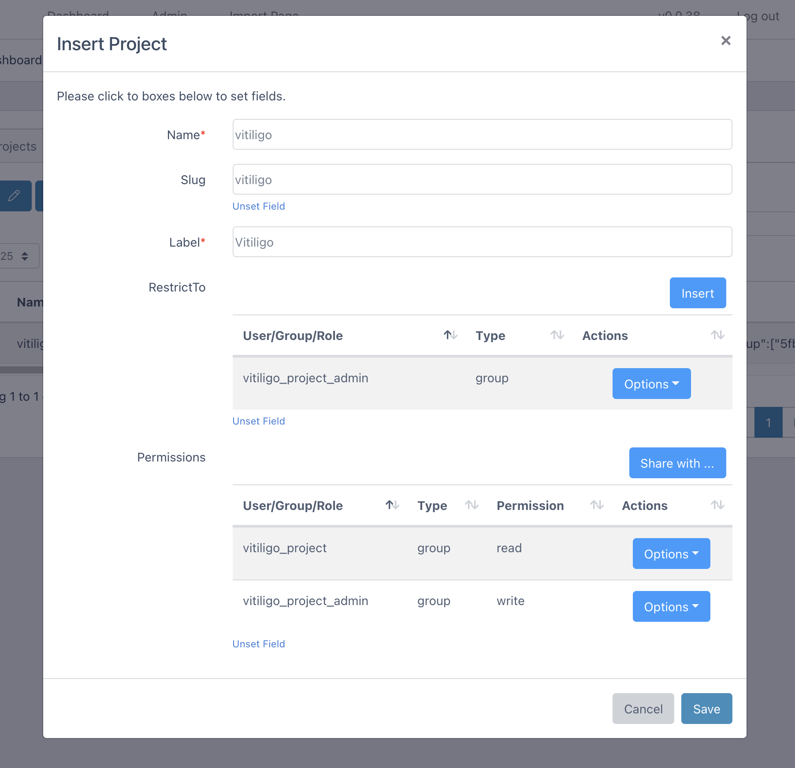
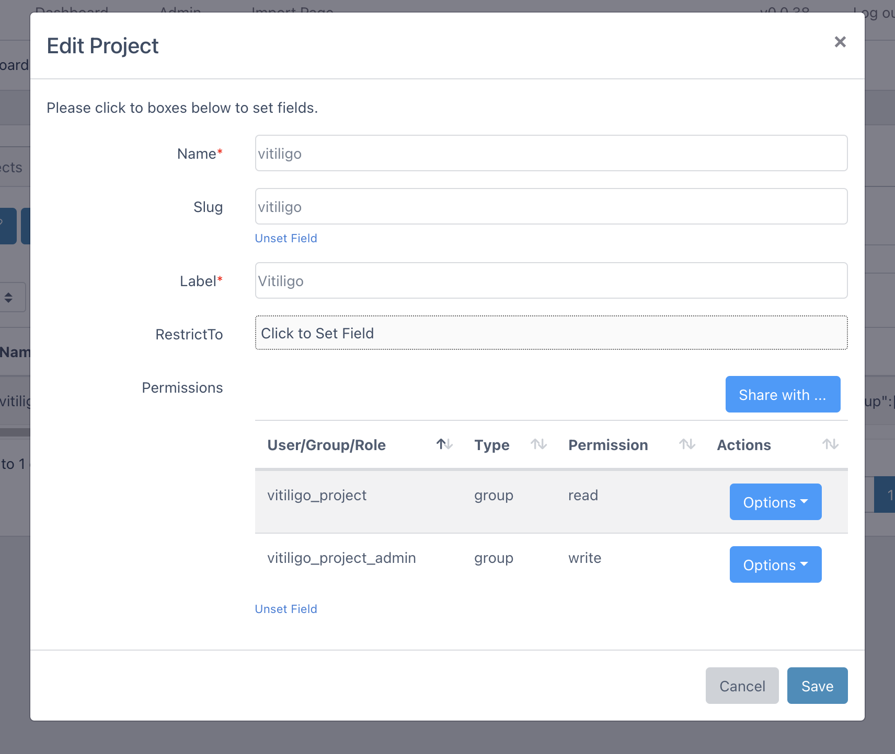

*************
Project Guide
*************

Projects are platforms to keep all of your collection and field data. At the top, there are three action buttons to manage projects: **insert**, **edit** and **delete**.

Insert Project
--------------

In order to insert a new project, you need to click on the insert button which will open new project form. Here you can enter following fields:

* **Name:** Project name is entered in this field. 

* **Label:** Long version of the project name is entered in this field. 

* **RestrictTo:** User or groups are selected who are allowed to **insert a new collection into project**. You may add new user/groups by clicking **insert** button. Afterwards, you may choose user/group/role to insert permission. If you want to remove the permission, please click **options -> delete** button.

* **Permissions:** User or groups are selected who are allowed to **view or edit the project**. You may add new user/groups by clicking **share** button. Afterwards, please choose user/group and read/write permission and click **save** button. If you want to edit/remove the permission, please click **options** button. 

Edit Project
------------

After clicking one of the checkboxes, you can start editing by clicking the edit button. A similar form window will open for editing.

Delete Project
--------------

In order to remove project, you can select one or multiple items with checkboxes and click the delete button.